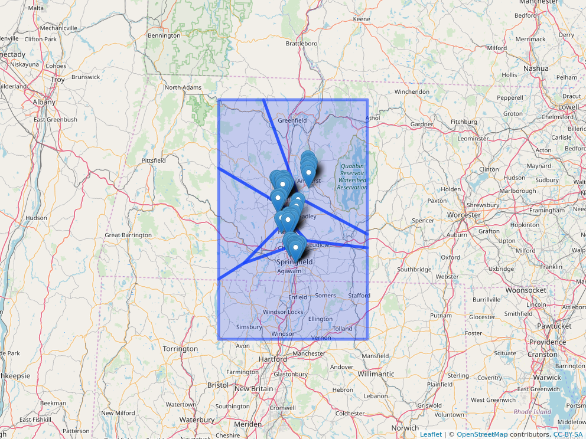

```{r include=FALSE}
#knitr::opts_chunk$set(eval=FALSE)
```

# Question and Approach

Question: How many miles were driven per community? 

Approach: 
1) Find way to get distance of a route.
2) Find way to decrease resolution of route data (get only n equally spaced points throughout time 1 to T).
3) Find way to define the space of the communities
4) Find out which community entry corresponds to
5) Process all files and aggregate based on community (which is now on every entry in the gps data).

# Tools

Our usual favorites and the `sf` simple features package for working with spatial data. 

```{r}
library(dplyr)
library(purrr)
library(tidyr)
library(leaflet)
library(sf)
```

We have already the stations and the communities. I got the communities by clustering around 6 centers using k means to classify all the stations (they all were correct). Then I process and end up doing a Voronoi tesellation with the help of the sf package to get the polygon regions that will be our communities. 
**Thus we already solved point # 3**

```{r}
load("../data/stations.rda")
load("../data/communities.rda")
```

```{r}
glimpse(stations)

communities
```

```{r}
stations <- stations %>%
    mutate(location = map2(longitude, latitude,
                           ~ st_point(c(.x, .y)))) %>%
    st_as_sf() %>%
    st_set_crs(4326)    
```

Right now we can see already how the polygons and the spatial data we got of the stations will help us answer our question.

```{r}
leaflet() %>%
    addTiles() %>%
    addPolygons(data = communities, popup = ~ community_name) %>%
    addMarkers(data = stations) %>%
    mapview::mapshot(file = "../resources/stations_on_communities.png")
```



**This function solves point # 2. Decreasing the resolution of the data.**

```{r}
make_data_thinner <- function(data, num_obs) {
    if(num_obs >= nrow(data)) {
        return(data)
    }
    n <- min(nrow(data), num_obs)
    mask <- round(seq(1, nrow(data), length.out = n))
    thinner_data <- data[mask, ]
    return(thinner_data)
}
```

Here is an example to get intuition behind function.

```{r}
make_data_thinner(mtcars, num_obs = 3)
```

```{r include=FALSE, eval=FALSE}
file_path <- "../inst/extdata/VB_Routes_Data_2019_09_10.csv.gz"

day <- file_path %>%
    data.table::fread(skip = 2) %>%
    janitor::clean_names() %>%
    group_by(route_id, bike, user_id) %>%
    nest() %>%
    mutate(data = map(data, ~ make_data_thinner(.x, num_obs = 20))) %>%
    unnest(data) %>%
    mutate(location = map2(longitude, latitude,
                        ~ st_point(c(.x, .y)))) %>%
    st_as_sf() %>%
    st_set_crs(4326)
```

**These function solves point # 4. Defining the community at the current entry of the gps data.**

```{r}
.get_current_community <- function(polygons, point) {
    mask <- st_contains(polygons$location, point, sparse = F)
    res <- polygons$community_name[mask]
    if(length(res) == 0) NA else res
}

get_current_community <- quietly(.get_current_community)
```

```{r, include=FALSE, eval=FALSE}
day <- day %>%
    mutate(community = map_chr(
               location, ~ get_current_community(communities, .x)$result
           ))
```

**This function solves #1 by using the `geosphere` package to calculate the N-1 distance values between N (long, lat) points.** We could use other distance measures but the important part is that this happens after the resolution of the data is decided on.

```{r}
get_path_distance <- function(data) {
    data %>%
        as.data.frame() %>% 
        select(longitude, latitude) %>%
        geosphere::distHaversine() %>%
        sum()
}

get_distance <- possibly(get_path_distance, NA)
```

```{r, include=FALSE, eval=FALSE}
distances <- day %>%
    group_by(route_id, community) %>%
    nest() %>%
    mutate(distance = map_dbl(data, get_distance)) %>%
    group_by(community) %>% 
    summarize(total_distance = sum(distance, na.rm=T)) 
```

And this is what we will do for every file. 

Review: 

1) Read in and choose data resolution (equally spaced points through time for route). Also creation of spatial feature column for use in 2.
2) For every route entry, determine which community it is currently in.
3) Grouping by route and community, get the corresponding distances, and then aggregate based on the community. 

```{r}
get_distance_community <- function(file_path, NUM, comment = TRUE) {
    if(comment == TRUE) {
        print(file_path)
    }
    
    day <- file_path %>%
        data.table::fread(skip = 2) %>%
        janitor::clean_names() %>%
        group_by(route_id, bike, user_id) %>%
        nest() %>%
        mutate(data = map(data,
                          ~ make_data_thinner(.x, num_obs = NUM))) %>%
        unnest(data) %>%
        mutate(location = map2(longitude, latitude,
                               ~ st_point(c(.x, .y)))) %>%
        st_as_sf() %>%
        st_set_crs(4326)

    day <- day %>%
        mutate(community = map_chr(
                   location, ~ get_current_community(communities,
                                                     .x)$result
               ))

    distances <- day %>%
        group_by(route_id, community) %>%
        nest() %>%
        mutate(distance = map_dbl(data, get_distance)) %>%
        group_by(community) %>%
        summarize(total_distance = sum(distance, na.rm=T)) 

    return(distances)
}
```

```{r}
empty <- tibble(community = NA_character_,
                total_distance = NA_real_)

possibly_get_distance_community <- possibly(get_distance_community,
                                            otherwise = empty)

```

```{r, cache=TRUE}
file_names <- fs::dir_ls("../inst/extdata",
                         regexp = "VB_Routes_Data_2019_.*")

res <- file_names %>%
    map_dfr(possibly_get_distance_community, NUM=2, comment=F)
```

```{r}
per_community <- res %>% group_by(community) %>% summarize(total_distance = sum(total_distance) / 1609.344)

per_community

per_community %>% summarize(total_distance = sum(total_distance, na.rm=TRUE))

```
