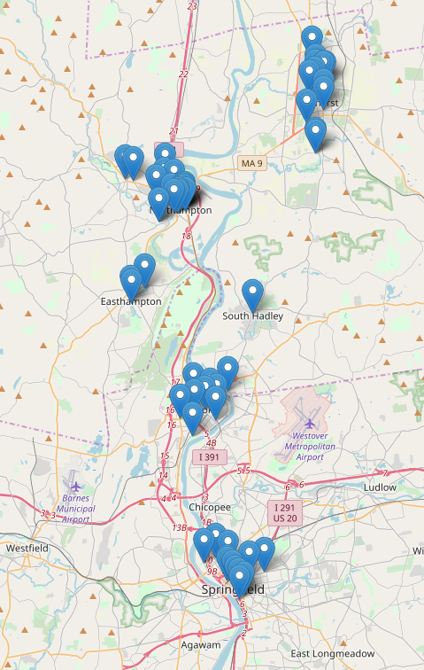
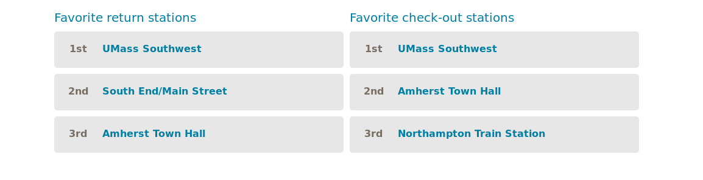

## Setup

```{r}
library(dplyr)
library(readr)
library(tidyr)
library(lubridate)
library(ggplot2)
library(leaflet)
```

## Ingestion

We import the slim version of the data that contains only the start and end entries for any given route, throughout all available data. 

```{r}
Routes <- read_tsv("../data/slim.tsv",
                   col_types = cols(
                       route_id = col_character(),
                       bike = col_number(),
                       date = col_datetime(format = ""),
                       latitude = col_double(),
                       longitude = col_double(),
                       user_id = col_character()
                   ),
                   na = c("-", "NA"))

Routes %>% head()
```

## Cleaning

Two things.

1) Our function to slim down the data actually took care of badly downloaded data so will get some lines that are only NAs.
2) The data actually has duplicate entries.

```{r}
Routes <- Routes %>%
    drop_na(-date)  %>% # 9 entries are NA only
    drop_na() %>%  # around 400 entries have no date info
    distinct()
```

We removed a tiny amount of data but it will simplify our lives to have data without NAs.

So far the assumption is that there is two entries for every route (the start and the end). Let's verify. 

```{r}
Routes %>%
    count(route_id, name = "num_entries") %>%
    count(num_entries, name = "count")
```

Less than 3% of the bikes have only one entry, while a single one has 3. For now we will drop these. 

```{r}
Inconsistent <- Routes %>%
    count(route_id) %>%
    filter(n != 2)

Routes <- Routes %>%
    anti_join(Inconsistent, by = "route_id")
```

These leaves 93253 routes with start and end entries (the trims of data have been almost none).

## Exploratory Data Analysis and Further Cleanup

###  We have data for what days? 

We know Valley Bike has only been a thing since 2017. Let's look at the data. 

```{r}
Routes <- Routes %>% 
    mutate(date_rounded = round_date(date, unit="day"))

Routes %>%
    count(date_rounded) %>%
    ggplot(aes(x = date_rounded, y = n)) +
    geom_point() +
    geom_smooth(method = "loess")
       
```

Let's take a closer look. It seems there are extraneous dates. 

```{r}
Routes %>%
    arrange(date) %>%
    head(15)
```

Great... 1980-2011 observations. There's only 11 of them so we will just filter those. The fix of the plot: 

```{r}
Routes <- Routes %>%
    filter(date_rounded >= "2017-01-01")
```

The command above introduced inconsistencies like before. We again want to make our routes have two entries each.

```{r}
Inconsistent2 <- Routes %>%
    count(route_id) %>%
    filter(n != 2)

Routes <- Routes %>%
    anti_join(Inconsistent2, by = "route_id")
```

```{r}
Routes %>%
    count(route_id, date_rounded) %>%
    count(date_rounded, name = "num_routes") %>%
    ggplot(aes(x = date_rounded, y = num_routes)) +
    geom_point() +
    geom_smooth(method = "loess", span=0.2, se = FALSE) +
    labs(x = "Date", y = "# of Rides",
         title = "How many rides in a day?") 

```

General usage seems to be predictable. The summers and the start of the semester are the most popular.

## 2) How many unique rides are there? 

```{r}
Routes %>%
  count(route_id) %>%
  count(name = "num_rides")
```

## 3) Where are the stations? 

Our method right now is to round off the coordinates to three decimal places. Then count them up and filter by the arbitrarily chosen value of 500. This means that there are more than 500 entries in that "location".

```{r}
Routes <- Routes %>%
    mutate(lat_rounded = round(latitude, 3),
           lon_rounded = round(longitude, 3))

Stations <- Routes %>%
    count(lat_rounded, lon_rounded, sort = T) %>%
    filter(n > 500) %>%
    arrange(desc(n)) %>%
    mutate(name = paste("Station", row_number())) %>%
    select(name, latitude = lat_rounded, longitude = lon_rounded)

glimpse(Stations)
```

We don't have the names right now but there seems to be a similar number of stations as the 56 we have here. We need to find a more sophisticated way of determining whether something is close to something or not.

```{r eval=FALSE}
Stations %>%
    leaflet() %>%
    addTiles() %>%
    addMarkers(lng = ~longitude, lat = ~latitude)
```

{width=75%}

We save for later our stations, from most to least "popular".

```{r}
write_tsv(Stations, path = "../data/stations.tsv")
```

## 4) What are the most popular stations for checkout/returns? Least? 

Let's identify returns and checkouts. Remember we have two entries, the start and the end of a route.

```{r}
Routes <- Routes %>%
    group_by(route_id) %>%
    mutate(action = if_else(date == min(date), "checkout", "return")) %>%
    ungroup()
```

And let's verify our data makes sense. 

```{r}
Routes %>%
    count(action)
```

Perfect! Now we can find the popularity for checkout/returns.

```{r}
Popularity <- Routes %>%
    count(lat_rounded, lon_rounded, action, sort = T)
```

```{r}
Popularity %>%
    filter(action == "checkout") %>%
    head(3) %>%
    glimpse()
```

```{r}
Popularity %>%
    filter(action == "return") %>%
    head(3) %>%
    glimpse()
```

Looking carefully (we could plot them too) we see that our most popular locations match the ones listed on the official site.



## 4) How does usage vary across the day? (Aggregate version)

The most bike usage occurs in the evening- with 9pm racking in the most with 15688 users returning or leaving from a trip. There does not appear to be much usage during the work-day, from 7am-5pm, as well as the early morning. There is a suprising amount of usage during the night, with 11pm and midnight rides tallying  14582 and 14582	users respectively. 

```{r}
Routes %>%
    mutate(hour = hour(date)) %>%
    count(hour, sort = T) %>%
    ggplot(aes(x=hour, y=n)) +
    geom_point() +
    geom_smooth(method = "loess", span=0.2)
```

The above is a good start but we will have to break it down because the hourly usage probably depends on the seasonal trends too.

## Save Our Progress

We have made some changes we would like to keep.

```{r}
Routes %>% names()
```

Write it out.

```{r}
write_tsv(Routes, path = "../data/slim_clean.tsv")
```
